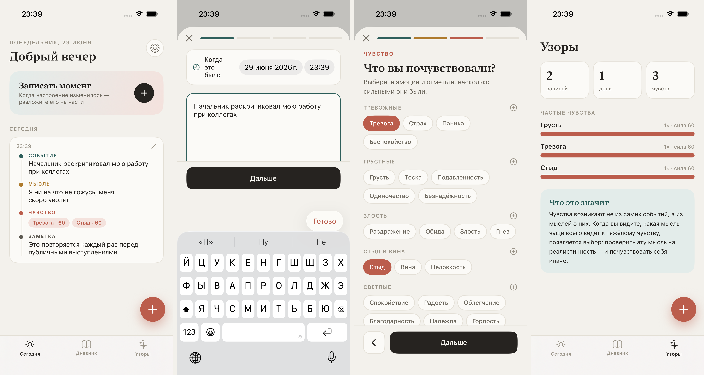

# Дневник КПТ (cbtapp)

Дневник в духе КПТ для разбора трудных моментов на три части: **Событие → Мысль → Чувство**.
Нативное iOS-приложение на SwiftUI с хранением в **SwiftData**. По умолчанию
данные хранятся локально; код для синхронизации через **iCloud (CloudKit)**
готов и его можно включить (нужен платный аккаунт Apple Developer).

Перенесено с TSX-макета на нативный Swift.

## Скриншоты



Слева направо: **Сегодня**, создание записи (момент с датой и временем),
выбор эмоций, **Узоры**.

## Возможности

- **Сегодня** — приветствие, кнопка записи момента, записи за сегодня.
- **Дневник** — все записи, сгруппированные по дням («Сегодня», «Вчера», дата).
- **Узоры** — статистика: число записей, дней, чувств и топ частых эмоций.
- Пошаговое создание записи: **событие → мысль → чувства → заметка**. На шаге
  события момент задаётся вручную — дата и время до минуты.
- Эмоции с ползунками силы (0–100). Каталог редактируемый: **свои разделы и
  эмоции** можно создавать в Настройках или прямо во время записи. По умолчанию
  есть раздел **«Тело»** — телесные наблюдения (дрожь, скованность, ком в горле
  и т. п.).
- **Заметка** — свободное поле в конце записи для всего, что не вошло в структуру
  событие → мысль → чувство.
- **Редактирование** и удаление записей.
- **Экспорт в PDF** с отправкой через системное окно «Поделиться».
- Светлая тема (системная тёмная игнорируется).
- Хранение в SwiftData (локально). Опционально — синхронизация между устройствами через CloudKit.

## Требования

- Xcode 16+
- iOS 18+
- Для запуска на устройстве: любой Apple ID (бесплатный Personal Team подойдёт).
- Для iCloud-синхронизации: платный аккаунт Apple Developer и контейнер
  CloudKit `iCloud.com.petara94.cbtapp`.

## Запуск на iPhone (бесплатный Apple ID)

1. Открыть `CBTDiary.xcodeproj` в Xcode.
2. Xcode → Settings → Accounts — войти своим Apple ID.
3. Таргет CBTDiary → Signing & Capabilities — выбрать свою Team,
   «Automatically manage signing». При необходимости поменять Bundle Identifier
   на уникальный (если `com.petara94.cbtapp` занят).
4. Подключить iPhone кабелем, выбрать его как destination, нажать ▶︎ Run.

Подпись бесплатного аккаунта действует 7 дней — потом приложение нужно
переустановить из Xcode. Данные хранятся локально на устройстве.

## Установка на iPhone без Mac (sideload)

CI на каждый push собирает **неподписанный `.ipa` под устройство** и кладёт его
в артефакт `CBTDiary-ipa-unsigned` (вкладка Actions → нужный запуск → Artifacts).

Дальше с обычного ПК (Windows или Linux):

1. Скачать артефакт `CBTDiary-ipa-unsigned` и распаковать `CBTDiary.ipa`.
2. Установить **Sideloadly** (Windows/Linux) или **AltStore** (AltServer).
3. Подключить iPhone по USB, в Sideloadly выбрать `CBTDiary.ipa`, ввести свой
   Apple ID — он подпишет приложение и поставит его на телефон.

Подпись бесплатного Apple ID живёт 7 дней — потом переустановить тем же способом.
Если `com.petara94.cbtapp` окажется занят, в Sideloadly можно задать свой Bundle ID.

В ЕС можно поставить **AltStore PAL** прямо на iPhone без компьютера (iOS 17.4+).

## Как включить iCloud-синхронизацию

Требуется платный Apple Developer Program.

1. Таргет → Signing & Capabilities → «+ Capability» → **iCloud**, отметить
   **CloudKit** и контейнер `iCloud.com.petara94.cbtapp`
   (entitlements уже есть в `CBTDiary/CBTDiary.entitlements`).
2. В `CBTDiaryApp.swift` заменить конфигурацию на
   `ModelConfiguration("CBTDiary", cloudKitDatabase: .automatic)`.

## Структура проекта

```
CBTDiary.xcodeproj          # проект (современный синхронизированный формат Xcode 16)
CBTDiary/
  CBTDiaryApp.swift         # точка входа, ModelContainer + сидинг каталога эмоций
  Models/                   # Entry, Feeling, EmotionCategory/Option (SwiftData), JournalPDF
  Views/                    # экраны и компоненты SwiftUI (вкл. SettingsView, ShareSheet)
  Theme/                    # палитра, шрифты, форматирование дат
  Assets.xcassets           # иконка, акцентный цвет
  CBTDiary.entitlements     # iCloud / CloudKit
CBTDiaryUITests/            # UI-тест основного флоу + захват скриншотов
Scripts/                    # make-screenshots.sh, stitch.swift
Screenshots/                # overview.png и исходные кадры для README
```

## Сборка

Открыть `CBTDiary.xcodeproj` в Xcode и запустить на симуляторе iOS 18.

CI (`.github/workflows/ios.yml`) на каждый push собирает приложение под
iOS Simulator без подписи и выкладывает `.app` как артефакт сборки.
Подписанная сборка/публикация в App Store требует секретов Apple Developer
и в CI пока не настроена.

## Тесты и скриншоты

`CBTDiaryUITests` — UI-тест, который проходит основной сценарий (создание
записи → выбор эмоций → дневник → узоры → настройки) и сохраняет скриншоты
каждого шага. Скриншоты для README генерируются им же:

```sh
./Scripts/make-screenshots.sh            # симулятор по умолчанию (iPhone 17)
DEVICE="iPhone 16" ./Scripts/make-screenshots.sh
```

Скрипт прогоняет тест на симуляторе, копирует кадры в `Screenshots/` и склеивает
4 экрана в `Screenshots/overview.png` (через `Scripts/stitch.swift`).

## Заметки по моделям и iCloud

- Все свойства моделей имеют значения по умолчанию, а связи опциональны —
  модель сразу совместима с автоматической схемой CloudKit, поэтому включить
  синхронизацию можно без изменения моделей.
- `ModelConfiguration(cloudKitDatabase: .automatic)` включает приватную базу.
- Синхронизация работает только при подписи с CloudKit-контейнером и входе в
  iCloud на устройстве (платный аккаунт разработчика).
